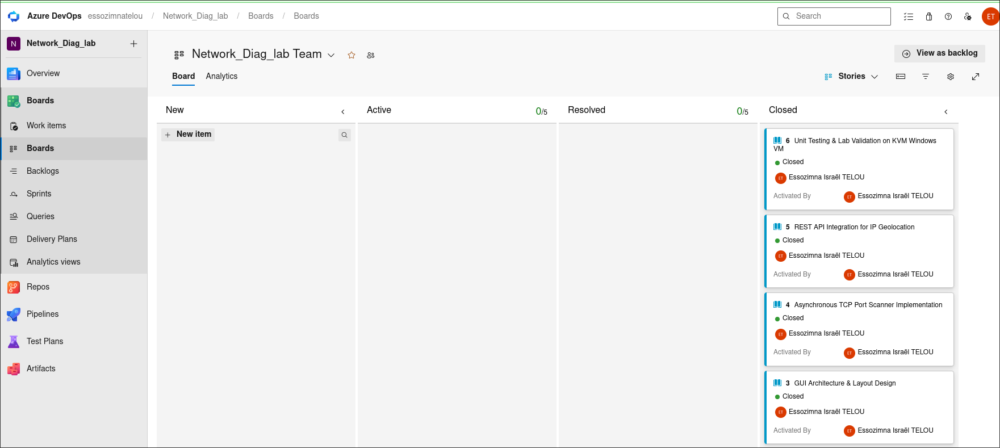
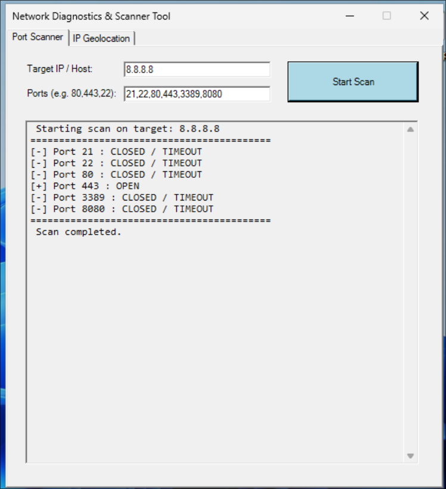
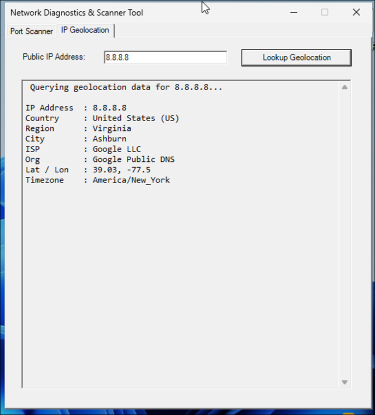

# PowerShell Network Diagnostics & Reconnaissance Tool

A GUI-based network diagnostic and threat intelligence tool developed in native PowerShell (Windows Forms). Designed for rapid infrastructure auditing, surface attack mapping, and IP geolocation analysis without external software dependencies.

---

## Key Features

* **Asynchronous TCP Port Scanner:** Multi-threaded/async socket connections for scanning key network ports without freezing the UI.
* **IP Threat Intelligence & Geolocation:** REST API integration (ip-api.com) over TLS 1.2 to retrieve ISP, Country, City, Organization, and Coordinates for target public IPs.
* **Agile Project Management:** Fully tracked through Azure DevOps Boards (Kanban methodology).

---

## Methodology & Project Management (Azure DevOps)

This project was planned and executed following Agile principles. Work items and lifecycle tracking were managed using Azure DevOps.



---

## Lab Execution & Results

### 1. TCP Port Scanner
Used to audit open listening ports on target servers or local interfaces.



### 2. IP Geolocation Lookup
Used to perform immediate origin attribution and threat analysis on public IP addresses.



---

## Requirements & Usage

* **OS:** Windows 10 / 11 or Windows Server
* **PowerShell:** Version 5.1 or higher
* **Execution:** Run PowerShell as Administrator and execute:
  ```powershell
  Set-ExecutionPolicy -ExecutionPolicy Bypass -Scope Process
  .\netdiag.ps1
